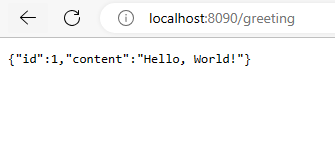

### Spring Boot Demo 3 Rest Service Example

**Steps:**
<ol>
<li>To setup IDE for Spring project, follow steps in https://github.com/worldpeacez0991/SpringBoot_demo1</li>

 

<li>Start Spring Boot App
<ul>
<li>Via Spring IDE, open 'RestServiceApplication.java', press 'Alt+Shift+X, B', to start 'Spring Boot App'</li>
<li>Via browser, type 'http://localhost:8090/greeting', to test</li>
<kbd></kbd> 
<li>Via browser, type 'http://localhost:8090/greeting?name=User1', to test</li>
<kbd></kbd> 
</ul>
</li>

 

 
<li>For running JUnit Test</li>
<ul>
<li>Via Spring IDE, open 'GreetingControllerTests.java', press 'Alt+Shift+X, T', to start 'Junit Test'</li>
<kbd></kbd> 
</ul>
</li>

</ol>

Credits: https://spring.io/team 
Source: https://spring.io/guides/gs/rest-service/

